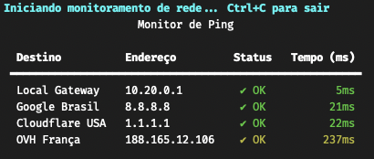

# pingmon

Uma ferramenta simples e visual para monitoramento de conectividade de rede via ping em múltiplos destinos.

 <!-- Coloque um print se quiser -->

## Funcionalidades

- Pings simultâneos a múltiplos destinos (rede local, servidores no Brasil, EUA, Europa, etc.);
- Atualização automática da tabela de resultados;
- Destaque para latências elevadas ou falhas de conexão;
- Painel com "Ocorrências Graves" para facilitar o diagnóstico;
- Compatível com macOS, Linux e Windows (ajustando comandos conforme o sistema).

## Como usar

1. Clone o projeto ou baixe o script `pingmon.py`;
2. Instale o pacote necessário:
   ```bash
   pip install rich
   ```
3. Execute no terminal:
   ```bash
   python pingmon.py
   ```
   ou
   ```bash
   .venv/bin/python pingmon.py
   ```


## Parâmetros atuais

Os destinos estão definidos diretamente no dicionário `DESTINOS` no início do script. Exemplo:
```python
DESTINOS = {
    "Local Gateway": "10.20.0.1",
    "Google Brasil": "8.8.8.8",
    "Cloudflare USA": "1.1.1.1",
    "OVH França": "188.165.12.106",
}
```

## Melhorias previstas

Esta é uma versão inicial, com melhorias já planejadas:
- Passar os destinos via argumento de linha de comando ou arquivo de configuração;
- Exportar resultados para CSV;
- Alertas por som, e-mail ou integrações.

## Licença

MIT. Sinta-se à vontade para utilizar e contribuir.
